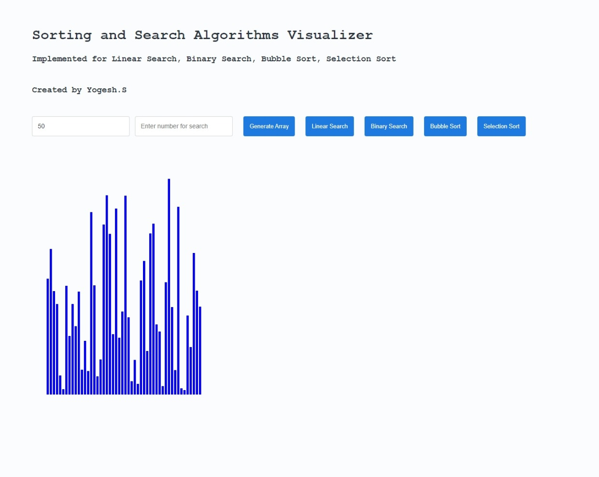

# Algo-Visualizer

### An Visualizer for Linear Search, Binary Search, Bubble Sort, Selection Sort 

### Steps to Use:
* Use this Visualiser to enhance your understanding on the basics of the Search and Sorting Algorithm.
* Enter the Dataset Size (>=5) and then click on "Generate Array"
* Then choose whether to sort or to search.
* If search , then enter the element to be searched and click the corresponding Searching Technique. If found, it prompts the index at which it is found at.

### Language Used:
Made with Vanilla HTML , CSS and JavaScript
 

## Try it now instantly ! :
Visit this [Github Link](https://yogeshcenation.github.io/Algo-Visualizer/) to see the project in action!

### Contributors:
* [__Yogesh S__](https://github.com/yogeshcenation)

### Screenshot:

